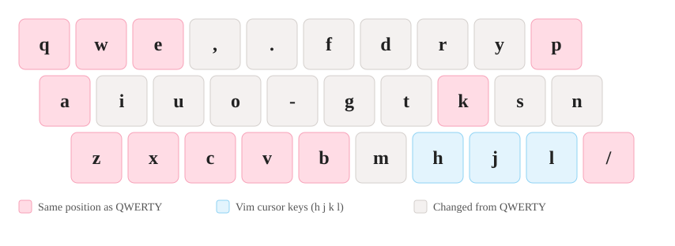

# Eucalyn Cost-Performance Layout (Eucalyn配列コスパモデル)

A logical keyboard layout for typing Japanese in romaji, built on top of the [Eucalyn layout](https://eucalyn.hatenadiary.jp/entry/about-eucalyn-layout).
It keeps **12 of 26 letters (46%) in their QWERTY positions**, so most of your existing shortcuts and muscle memory survive, while still moving vowels and common consonants onto the home row.

Eucalyn 配列をベースにした、ローマ字入力向けの論理配列です。移行コストとショートカットの使いやすさを優先し、アルファベット 26 キーのうち 12 キー（約 46%）を QWERTY と同じ位置に残しています。




```
q w e , . f d r y p
a i u o - g t k s n
z x c v b m h j l /
```

Home row: `a i u o -` / `g t k s n`

## Try it / 練習する

A browser-based typing trainer is published separately (desktop only, Windows / Mac). Turn your Japanese IME off and type in plain alphabet mode. Progress stays in your browser.

- **Web trainer:** https://eucalyn-cust-performance-mudel.netlify.app/

別途公開している練習サイトです（PC 専用）。日本語入力は OFF にして使ってください。入力履歴はブラウザ内にだけ保存されます。

## Features / 特徴

- **Vowels on the left hand.** `a` `i` `u` `o` stay on the left; `u` and `e` sit on the middle finger, so the five vowels do not form a flat row.
- **Vim keys kept.** `h` `j` `k` `l` form an inverted T at the bottom right, and `w` / `q` (save / quit) stay where they are.
- **12 keys match QWERTY.** `q w e p a k z x c v b /` are unchanged, which keeps shortcuts such as Ctrl+A.
- **Moderate efficiency by design.** The goal is a layout that is cheap to move to, not the highest possible score.

## Install / 導入

A logical layout is set up with a key remapper or your OS. Your keyboard's physical keys do not change. Switching back to QWERTY is just disabling the remap.

### macOS (Karabiner-Elements)

1. Install [Karabiner-Elements](https://karabiner-elements.pqrs.org/).
2. Add the entries from [`integrations/karabiner/simple_modifications.json`](integrations/karabiner/simple_modifications.json) to the `simple_modifications` section of your Karabiner profile (`~/.config/karabiner/karabiner.json`).

### Windows

[PowerToys Keyboard Manager](https://learn.microsoft.com/en-us/windows/powertoys/keyboard-manager) can remap single keys. Use the mapping table below. A ready-made script is not included yet.

### Mapping table / 対応表

Press the QWERTY key on the left, get the letter on the right. Keys not listed are unchanged.

| QWERTY | → | Output | QWERTY | → | Output |
| --- | --- | --- | --- | --- | --- |
| `r` | → | `,` | `h` | → | `g` |
| `t` | → | `.` | `j` | → | `t` |
| `y` | → | `f` | `l` | → | `s` |
| `u` | → | `d` | `;` | → | `n` |
| `i` | → | `r` | `n` | → | `m` |
| `o` | → | `y` | `m` | → | `h` |
| `s` | → | `i` | `,` | → | `j` |
| `d` | → | `u` | `.` | → | `l` |
| `f` | → | `o` | `-` | → | `;` |
| `g` | → | `-` |  |  |  |

## Design notes / 設計メモ

1. **Minimal migration cost:** keep as many QWERTY positions as possible.
2. **Vim compatibility:** `h` `j` `k` `l` for cursor movement, `w` and `q` stay put.
3. **Balanced efficiency:** within the two constraints above, concentrate typing on the home row, avoid same-finger repeats and spread load across fingers.

The Eucalyn layout is the starting point. Compared with it, `d` and `r` are swapped, `r` is moved to the middle finger, and `e` is moved up to form the vowel "convex" shape. Background and reasoning (Japanese): [note article](https://note.com/hyu_nisworks/n/n98e034b02379).

背景と詳しい設計意図は [note 記事](https://note.com/hyu_nisworks/n/n98e034b02379) を参照してください。

## Credits / 引用・紹介

- Based on the [Eucalyn layout](https://eucalyn.hatenadiary.jp/entry/about-eucalyn-layout) (ゆかりメモ).
- If you introduce this layout, please link to the [note article](https://note.com/hyu_nisworks/n/n98e034b02379) (at the layout author's request).
- Efficiency was measured with [Keyboard Layout Analyzer](https://patorjk.com/keyboard-layout-analyzer/).

配列を紹介する場合は、[note 記事](https://note.com/hyu_nisworks/n/n98e034b02379) へのリンクを付けてください（配列作者の希望に基づく）。
